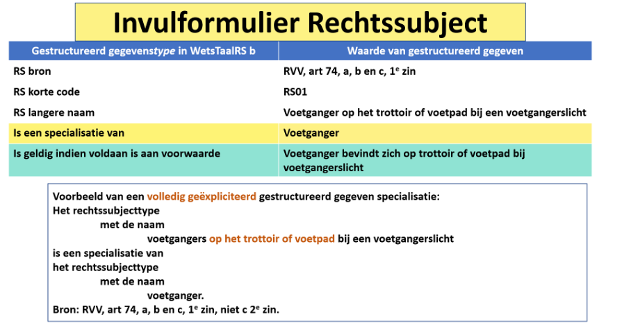
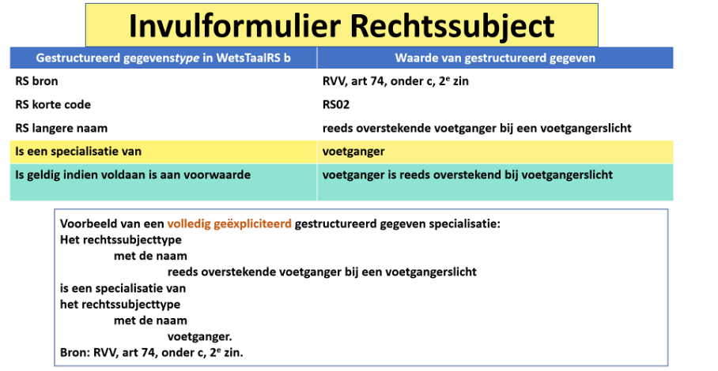

# Rechtssubject
In dit hoofdstuk gaan we de semantische (wat betekent een term?) en syntactische regels (welke uitdrukkingen met deze term zijn toegestaan?) beschrijven van het onderdeel Rechtssubject van de logisch formele, declaratieve en breed begrijpelijke taal met de naam WetsTaal. Met deze taal worden voor zowel de wetgeving als de wetsuitvoering logisch formele modellen opgesteld waarmee de wetsuitvoering vanaf het prille begin van het wetgevingsproces getest kan worden.

Dat betekent dat wetgeving op die manier opgesteld, volledig is, breed begrijpelijk en waarbij de computer effectief kan worden ingeschakeld om de complexiteit te minimaliseren en de wetgeving aangevuld met ontbrekende gegevens toegevoegd in het multidisciplinaire team op basis van de patronen in WetsTaal en daardoor de bedoelde wetgeving volledig te expliciteren in het wetgevingsmodel. De taal is een zogenaamde gecontroleerde natuurlijke taal. Dat betekent zowel begrijpelijk voor de meerderheid van de mensen als computers.

Beide beschrijvingen, zowel van de syntax (welke uitdrukkingen zijn toegestaan?) als de semantiek (wat betekent een term?)  spelen een belangrijke rol bij wetgeving en wetsanalyse op basis van patroonherkenning, zoals ook in een aantal andere exacte wetenschappen met groot succes wordt gebruikt. Bij die patroonherkenning willen we bewust een stuk overtolligheid inbouwen om in situaties waarin meer dan een enkel gestructureerd gegeven in de juridische bron ontbreekt, de patroonherkenning nog steeds effectief en snel te laten werken.

## Waarom beginnen we met rechtssubject?
De structuur van wetgeving die sinds 2012 steeds meer in kaart is gebracht, anders gezegd is gemodelleerd in een logisch formeel, declaratief en breed begrijpelijk model, laat zien dat rechtssubject als eerste vereist is om andere fundamentele begrippen of bouwblokken van wetgeving en wetsuitvoering zoals rechtsbetrekking, rechtsfeit en rechtsgevolg adequaat te kunnen beschrijven.

De structuur van wetgeving is sinds 2012 steeds meer bloot gelegd op basis van het modelleren van de :

- begripsomschrijvingen,
- gegevens,
- regels, en
- processen.

Hierbij is voor elke term gebruikt in gegevens, regels of processen die in het multidisciplinaire team niet als glashelder kan worden aangeduid voor de meerderheid van de Nederlanders, een begripsomschrijving opgesteld. Deze structuur blijkt behoorlijk krachtig te zijn. Door die kracht volledig te expliciteren, kan deze kennis gebruikt worden tijdens alle stappen van het wetgevings- en wetsuitvoeringsproces.

Die structuur is tot nu toe onvoldoende en vaak geheel niet beschreven in de leerboeken Inleiding Rechtsgeleerdheid. Vanuit dat perspectief is het heel goed te verklaren waarom er zo veel misgaat in wetsuitvoering dat zelfs de eerste minister het woord schande gebruikt.

Het niet bewust zijn van die structuur in de leerboeken voor het opstellen van wetgeving kan aangemerkt worden als d voornaamste oorzaak van de problemen in de wetsuitvoering. Maar de wetgevingsjuristen zijn eigenlijk ook slachtoffer van het feit dat zij tijdens hun opleiding niet bekend gemaakt zijn met kennisanalysetechnieken en de onderliggende structuur van wetgeving. Zou dat wel het geval zijn, dan is de verwachting dat de kwaliteit van wetgeving structureel veel hoger zou liggen.

##	Wat is een rechtssubject?
De begripsdefinitie van de term rechtssubject:

Een rechtssubject is
- de drager van [=rechten=] en [=plichten=], en/of
- de generator van [=juridisch relevante feiten=], en/of
- de uitvoerder van [=rechtshandelingen=] en [=feitelijke handelingen met rechtsgevolg=].

## Voorbeelden van rechtssubjecten
In onderstaand diagram zijn een aantal voorbeelden van rechtssubjecten gegeven die bij veel Nederlanders bekend zijn.

In bovenstaand diagram is onder meer ook het volgende uitgebeeld:

Het rechtssubjecttype buitenlandsbelastingplichtige voor de inkomstenbelasting is een deelverzameling van het rechtssubjecttype natuurlijke persoon. Het rechtssubjecttype natuurlijke persoon en een deelverzameling van het rechtssubjecttype rechtssubject.

Verder kunnen we de volgende feiten uit het diagram in tekst omzetten:

Andre Rieu, Max Verstappen en ASML zijn voorbeelden van bekende Nederlandse rechtssubjecten.
Andre Rieu en Max Verstappen zijn ook voorbeelden van de specialisatie van rechtssubject, met de naam natuurlijk persoon.
ASML is een voorbeeld van de specialisatie van rechtssubject met de naam rechtspersoon.
Andre Rieu is een binnenlandsbelastingplichtige voor de inkomstenbelasting. Waarom is dat zo? Omdat Andre Rieu in Nederland woont. (IB 2.1, a)
Max Verstappen is een buitenlandse belastingplichtige voor de inkomstenbelasting. Waarom is dat zo? Omdat Max Verstappen in het buitenland woont maar wel Nederlands inkomen geniet. (Wet op de Inkomstenbelasting artikel 2.1,b).

Het voorgaande is duidelijk een verrijking van het begrip van Wet op de inkomstenbelasting artikel 2.1. Maar op welk niveau speelt dit? Dat is het abstracte niveau van wetgeving, waarbij – stilzwijgend – verzuimd is expliciet aan te geven dat hier het perspectief van een bepaald moment of periode in de tijd bedoeld is. Dat is wat genoemd wordt het objectieve recht. Het objectieve recht is het recht beschreven in wetgeving.
Maar dat is niet het perspectief van de burger. In zijn concrete belevingswereld heeft hij expliciet rekening te houden met perioden en momenten in de tijd. Dat is het subjectieve recht, het recht gezien vanuit het perspectief van de burger of bedrijf.

## Het patroon met 4 gestructureerde gegevens rond rechtssubject, oftewel welke uitdrukkingen van een rechtssubject zijn toegestaan
Het patroon van gestructureerde gegevens rond rechtssubject hebben we nodig om adequaat antwoord te kunnen geven op de twee vragen van de burger:

-	voor wie zijn deze [=plichten=] bedoeld?
-	voor wie zijn deze [=rechten=] bedoeld?

We zullen dat eerst toelichten aan de hand van het concrete geval van het voetgangerslicht, te weten artikel 74, lid 1, onder c, 1e zin:

**Artikel 74**

1. Bij voetgangerslichten betekent: 
~~a. groen licht: voetgangers mogen oversteken;~~ 
~~b. groen knipperend licht: voetgangers mogen oversteken; het rode licht verschijnt spoedig;~~ 
c. rood licht: voetgangers mogen niet meer beginnen over te steken; reeds overstekende voetgangers moeten zo snel mogelijk doorlopen. 

We zien in bovenstaande tekst dat we te doen hebben met twee verschillende specialisaties van  rechtssubjecten bij het voetgangerslicht:

- voetgangers op het trottoir of voetpad bij een voetgangerslicht en
- reeds overstekende voetgangers bij een voetgangerslicht.

We zullen hierna laten zien hoe dat bij Wetsanalyse o.b.v. de regels van WetsTaal deze twee soorten rechtsbetrekkingen expliciet naar voren komen in het model voor RVV, artikel 74, lid 1.

Van een rechtssubject noteren we 4 gestructureerde gegevens in de vulling van het wetsmodel, de concrete wereld van de burger.

Dat is:

- de identificatie van een rechtssubject, naar keuze in de vorm van
  - een korte code of
  -	een langere naam, of
  -	beide
- de specialisatie van een rechtssubject en het bovenliggende rechtssubject waarvan dit rechtssubject een specifieke categorie is. Voorbeeld: een natuurlijk persoon is een rechtssubject van vlees en bloed.
-	de voorwaarde waaronder het rechtssubject behoort tot de specifieke categorie. Voorbeeld: een voetganger (een rechtssubject) is een natuurlijk persoon (een rechtssubject) die aan het verkeer deelneemt.

## Invulformulier voor rechtssubject
Hieronder ziet u de invulling van een formulier voor het geval van een voetganger die op het trottoir of voetpad staat bij een Voetgangerslicht.

In dit geval is het eerste gestructureerde gegeven van een rechtssubject de identificatie:

Binnen de collectie van alle rechtssubjecten binnen RVV art 74 lid 1 identificeert voetganger op het trottoir bij een voetgangerslicht een specifiek rechtssubject. Hier is de langere naam als identificatie voor rechtssubject gebruikt.
Er had ook gekozen kunnen worden hier binnen het kennisdomein Voetgangerslicht deze twee rechtssubjecten aan te duiden met de korte code als RS01 en RS02.

Het derde gestructureerde gegeven van een rechtssubject bevat het feit welk rechtssubject is specialisatie van een hoger rechtssubject in de boom van rechtssubjecten.
In dit concrete geval hebben we:

Rechtssubject
    met de naam
        Voetganger op het trottoir of voetpad bij een voetgangerslicht
is een specialisatie van
rechtssubject
    met de naam
        voetganger.

Het vierde gestructureerde gegeven van een rechtssubject is de voorwaarde waaronder de specialisatie geldig is. In dit concrete geval hebben we als vierde gestructureerde gegeven:

De voorwaarde op de specialisatie van het rechtssubject voetganger op het trottoir of voetpad bij een voetgangerslicht is geldig indien voldaan is aan de voorwaarde Voetganger bevindt zich op het trottoir of voetpad bij een voetgangerslicht.

In onderstaand formulier zijn 5 gestructureerde gegevens ingevuld bij een rechtssubject, het vijfde is de bron. Het ter beschikking hebben van het gestructureerde gegeven Bron helpt om met krachtige ondervraagtalen effectief te kunnen werken bij wetgeving en wetsuitvoering.

Het tweede voorbeeld van een rechtssubject dat voorkomt in RVV, art 74, lid is hieronder ingevuld in een invulformulier voor Rechtssubject. Men zou kunnen dat er twee gegevens records zijn gebruikt om de volledig geëxpliciteerde kennis te kunnen borgen van de twee van de drie rechtssubjecten in RVV, art 74, lid 1.
Wie is het derde Rechtssubject? Dat staat niet in RVV, art 74, lid 1. Dat heeft het multidisciplinaire team op basis van de patronen van WetsTaal na beraad toegevoegd. En dat is de Staat.

De hierboven ingevulde formulieren laten de 5 gestructureerde gegevens zien van een rechtssubject.

##	Het patroon rond rechtssubject
Het patroon rond rechtssubject is op grammaticaal niveau en dat is veel abstracter dan het concreet ingevulde formulier voor rechtssubject. Het invulformulier bevat een instantiatie of invulling van het patroon. Het patroon is hieronder weergegeven. Hier is het gestructureerde gegeven voor bron weggelaten evenals de twee optionele mogelijkheden om een korte code of langere naam toe te wijzen. M.a.w. in het meest expliciete geval hebben we te doen met 5 gestructureerde gegevens om een rechtssubject volledig declaratief te beschrijven.

## De samenhang tussen patroon en ingevuld formulier voor rechtssubject
De ervaring heeft ons geleerd dat het nuttig is om de samenhang van het concrete niveau van de ingevulde gestructureerde gegevens waar de burger direct mee te maken heeft zoals weergegeven in een invulformulier met het abstracte grammaticaal niveau van het patroon van rechtssubject te laten zien. Dat is hieronder weergegeven. Het onderste deel is het patroon, het bovenste deel het ingevulde formulier.

## Kennisweergave in tekst en schemavorm alsmede hun 1:1 connecties voor rechtssubject
Ook is nuttig gebleken om rechtswetenschappelijke kennis zowel in tekst als in schemavorm weer te geven. Over het algemeen is schemavorm een meer productieve vorm. Door twee kennisrepresentaties ter beschikking te stellen hebben de professionals in het MDT keuze.

Dit patroon kan worden gebruik tijdens het wetgevingsproces om de feiten over rechtssubject compleet te krijgen vanaf het prille begin. In het wetsanalyse proces worden dezelfde patronen gebruikt om de kennis die nogal eens ontbreekt in wetgeving aan te vullen en alsnog aldus volledig geëxpliciteerd te krijgen. 
